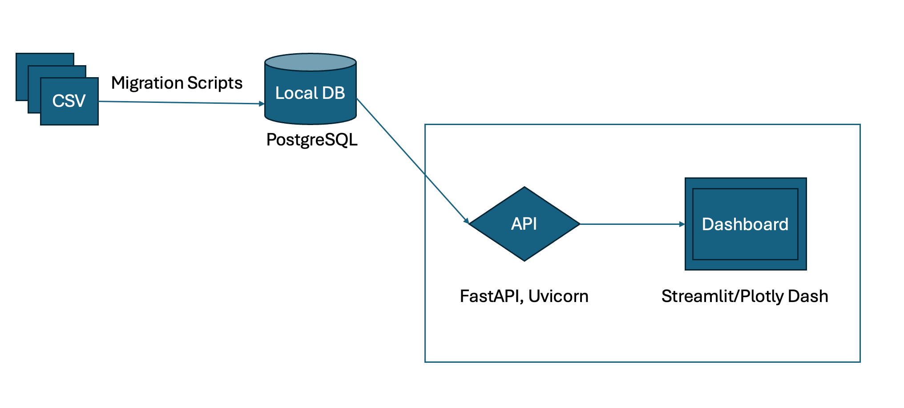
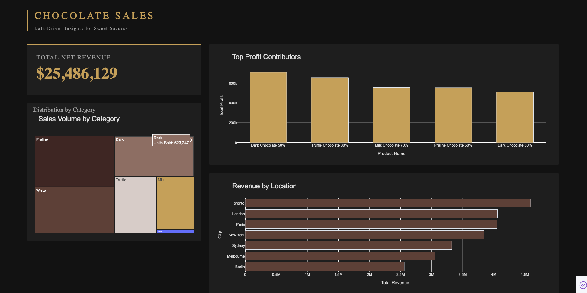

# 🍫 Chocolate Sales - Data Engineering & Analytics Dashboard

This project demonstrates a complete **Data Engineering & Business Intelligence** pipeline. It transforms raw sales data from CSV files into actionable insights through a containerized PostgreSQL database, a RESTful API, and an interactive executive dashboard.

---

## 🔄 Project Workflow
The following diagram illustrates the data journey from raw files to the final visualization:



1.  **Extraction**: Raw CSV files containing 50,000+ sales records.
2.  **Migration**: Python scripts (ETL) clean and migrate data into a Local PostgreSQL instance.
3.  **Serving**: A FastAPI server (Uvicorn) acts as the bridge, providing data through optimized KPI endpoints.
4.  **Visualization**: An interactive Plotly Dash dashboard consumes the API to display real-time business metrics.

---

## 🚀 Features
* **Automated ETL**: Handles data cleaning and manages orphan records.
* **Relational Database**: Optimized PostgreSQL schema with Foreign Key constraints.
* **KPI API**: Dedicated endpoints for Revenue, Profit, and Category performance.
* **Executive Dashboard**: Modern "Dark Mode" interface with interactive charts.
* **Containerization**: Docker-ready database for consistent environments.

---

## 🛠️ Tech Stack
* **Language**: Python 3.14
* **Database**: PostgreSQL 15 (via Docker)
* **Backend**: FastAPI + Uvicorn
* **Frontend**: Plotly Dash
* **Data Handling**: Pandas + Psycopg 3

---

## ⚙️ Installation & Setup

### 1. Clone the repository
```bash
git clone [https://github.com/EnriqueCGg/Chocolate-Sales.git](https://github.com/EnriqueCGg/Chocolate-Sales.git)
cd Chocolate-Sales
```

### 2. Configure Environment & Database
Create your environment variables and start the database:
```bash
cp .env.example .env
# Ensure credentials in .env match docker-compose.yml
docker compose up -d
```

### 3. Install Dependencies
```bash
python3 -m venv .venv
source .venv/bin/activate
pip install -r requirements.txt
```

### 4. Run the ETL Pipeline
Migrate the CSV data into your PostgreSQL instance:
```bash
python3 scripts/load_csv_to_db.py
```

---

## 🖥️ Usage

### Step 1: Start the API
The dashboard requires the API to be running to fetch data.
```bash
uvicorn app.main:app --reload
```
*API Docs: [http://127.0.0.1:8000/docs](http://127.0.0.1:8000/docs)*

### Step 2: Launch the Dashboard
In a **new terminal tab**, run:
```bash
python3 dashboard/app.py
```
*Access the Dashboard: [http://127.0.0.1:8050](http://127.0.0.1:8050)*

---

## 📊 Dashboard Preview


---

## 📊 Available KPIs
| Endpoint | Description |
| :--- | :--- |
| `/kpi/total-revenue` | Returns the sum of all sales revenue. |
| `/kpi/top-profitable-products` | Lists the top 5 products by profit margin. |
| `/kpi/performance-by-city` | Ranks cities based on order volume and revenue. |
| `/kpi/category-sales` | Breakdown of units sold per chocolate category. |

---

## 🤝 Collaborators
* **Enrique Arturo Emmanuel Chi Gongora**
* **Andrea Camila González Novelo**
* **Kevin Daniel Castellanos Chan**
* **Lizandro Emiliano Martin Alpuche**
* **Alejandra Saraí Vizcarra May**
```